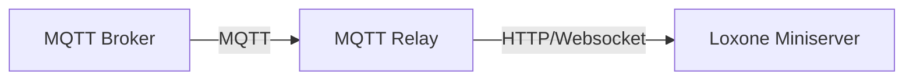
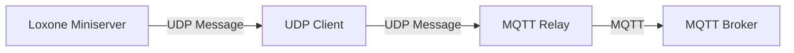

# MQTT Relay for Loxone

[](https://opensource.org/licenses/MIT)


[](https://hub.docker.com/r/acidcliff/loxmqttrelay)

This MQTT Relay enables seamless communication between your MQTT devices/services and Loxone Miniserver.
It is heavily insipred and based upon the extraordinary work of [Loxberry](https://github.com/mschlenstedt/Loxberry) - especially the MQTT Gateway.

The MQTT has been created with several goals in mind:
- Follow best practices established by the Loxberry community
- Providing isolated MQTT bridging capabilites for scenarios, where a full Loxberry installation is not necessary
- Enabling provisioning over Docker
- Optimizing for low power scenarios

To achieve these goals the MQTT Relay for Loxone uses more opionionted and minimalist approach:
1. Inbound communication with the MQTT Relay is done exclusively via UDP, with a reduced featureset compared to Loxberry
2. Outbound communication with the Miniserver is done exclusively via HTTP/Websocket (no UDP capability)
3. Interaction with the MQTT Relay is done primarily via MQTT with just a minimal UI for configuration (and even here editing the config file is recommended), but no integrated functionality like MQTT-Finder, Incoming Message Overview 
4. Except for boolean mapping and JSON flatteining, no transformers
5. No provisioning of an integrated packaged MQTT broker

The general mindset is to use MQTT Relay for Loxone in conjunctin with other tools:
- Using MQTT Monitoring tools like MQTT Explorer to find MQTT-Topics and get information about the processed and forwarded topics from the MQTT Relay
- Using middleware like Node-Red, Homeassistant for transformation of topics
- Using an external MQTT Broker of your choice

> ⚠️ **Disclaimer**: This project is not affiliated with, endorsed by, or connected to Loxone Electronics GmbH in any way. Loxone and Miniserver are trademarks of Loxone Electronics GmbH.

## Quick Start

### Run with docker (recommended)
```bash
```
### Local installation
```bash
  1. Clone the repository:
    ```bash
    git clone https://github.com/Jakob-Gliwa/loxMqttRelay.git
    cd loxmqttrelay
    ```

  2. Copy the default configuration:
    ```bash
    cp config/default_config.toml config/config.toml
    ```

  3. Edit config/config.toml with your settings:
    ```toml
    [broker]
    host = "your-mqtt-broker"
    port = 1883
    
    [miniserver]
    miniserver_ip = "your-miniserver-ip"
    miniserver_user = "your-user"
    miniserver_pass = "your-password"
    ```

  4. Run:
    ```bash
    uv venv .venv 
    source .venv/
    bin/activate
    uv pip install .
    python loxmqttrelay
    ```
```
## Architecture

#### MQTT Subscribe

#### MQTT Publish



## Features

- Bidirectional communication between MQTT and Loxone
- Dynamic topic filtering and whitelisting
- JSON payload expansion for complex data structures
- Automatic boolean value conversion
- Live configuration updates via MQTT
- Automatic synchronization of whitelisted topics using the Miniserver configuration
- Topic monitoring and processing feedback
- Web-based configuration UI
- UI & headless mode operation

## UDP Communication

The Relay accepts UDP messages on the configured port (default: 11884). Messages should be space-separated in one of these formats:

```
publish topic message    # Explicitly publish a message
retain topic message    # Publish a retained message
topic message          # Defaults to publish
```

Examples:
```
publish home/livingroom/light on
retain home/temperature 22.5
home/kitchen/light off    # Will be published without retain
```

## Basic Setup

1. Copy the provided `default_config.toml` as your starting point:
   ```bash
   cp config/default_config.toml config/config.toml
   ```
2. Configure your MQTT broker settings and other preferences in `config.toml`
3. Set up your Miniserver connection details
4. Start the MQTT Relay

## Running the MQTT Relay

The MQTT Relayy can be started in two modes:

1. Normal mode (with UI):
```bash
python main.py
```

2. Headless mode (without UI):
```bash
python main.py --headless
```

You can also set the logging level:
```bash
python main.py --log-level INFO
```

## Docker Deployment

You can run the MQTT Relay using Docker. The image is configured to run either in normal mode (with UI) or headless mode, with configurable logging levels.

### Basic Docker Run

```bash
docker run -d \
  -v /path/to/your/config:/app/config \
  -e HEADLESS=true \
  -e LOG_LEVEL=INFO \
  -p 11884:11884/udp \
  -p 8501:8501 \
  mqttrelay
```

### Configuration

- **Volume Mapping**: Mount your configuration directory to `/app/config` in the container. This directory should contain your `config.toml` file:
  ```bash
  -v /path/to/your/config:/app/config
  ```

- **Logging Level**: Control the verbosity of logging:
  - Set `LOG_LEVEL` to one of: DEBUG, INFO, WARNING, ERROR, CRITICAL
  - Default is INFO if not specified
  - Example: `-e LOG_LEVEL=DEBUG` for detailed logging

- **HEADLESS Mode**: Control whether the UI should be enabled:
  - Set `HEADLESS=true` to run without UI (recommended for production)
  - Set `HEADLESS=false` or omit to enable the UI
  - When UI is enabled, port 8501 needs to be exposed to access it

- **Ports**:
  - UDP port (default 11884) for receiving UDP messages
  - Port 8501 for the web UI (only needed if not running in headless mode)

### Example docker-compose.yml

```yaml
version: '3'
services:
  mqttrelay:
    build: .
    volumes:
      - ./config:/app/config
    environment:
      - HEADLESS=true
      - LOG_LEVEL=INFO
    ports:
      - "11884:11884/udp"
      - "8501:8501"  # Only needed if HEADLESS=false
    restart: unless-stopped
```

## Configuration

The MQTT Relay can be configured through a `config.toml` file or using the web-based configuration UI. A default configuration file (`default_config.toml`) is provided as a starting point with sensible defaults.

### Logging Configuration

The logging level can be set in three ways, with the following priority (highest to lowest):

1. Command-line argument:
   ```bash
   python main.py --log-level DEBUG
   ```

2. Environment variable (when using Docker):
   ```bash
   docker run -e LOG_LEVEL=DEBUG ...
   ```

3. Configuration file (config.toml):
   ```toml
   [general]
   log_level = "INFO"
   ```

Available log levels: DEBUG, INFO, WARNING, ERROR, CRITICAL
- DEBUG: Detailed information for debugging
- INFO: General operational information
- WARNING: Warning messages for potential issues
- ERROR: Error messages for serious problems
- CRITICAL: Critical issues that may prevent operation

If an invalid log level is provided, it will default to INFO with a warning message.

### UI Control

The web-based configuration UI can be controlled in several ways:

1. Via MQTT:
   - Start UI: Publish any message to `{base_topic}startui`
   - Stop UI: Publish any message to `{base_topic}stopui`
   - The relay will respond with status messages on `{base_topic}ui/status`
   - If the UI is already running/stopped, you'll receive a message indicating that
   - If there's an error starting/stopping the UI, you'll receive an error message with details

2. Manually: Run `streamlit run ui.py` in the MQTT Relay directory

The UI provides a user-friendly interface for:
- Configuring MQTT broker settings
- Managing topic subscriptions and filters
- Setting up HTTP communication
- Controlling boolean conversion and JSON expansion
- Managing the topic whitelist
- And more...

When using the UI, you'll need to specify the path where your configuration file should be stored. The UI will:
- Pre-fill the path with the default location (config/config.tomö) if a configuration exists there
- Allow you to specify a custom path for your configuration file
- Create the necessary directories when saving if they don't exist
- Disable save operations until a valid configuration path is specified

You can also upload an existing configuration file to pre-fill the UI fields without overwriting your actual configuration. This is useful when you want to:
- Start from an existing configuration as a template
- Test different configurations before saving
- Import settings from another installation

### MQTT Broker Settings
```toml
[broker]
host = "test.mosquitto.org"
port = 1884
user = ""  # null becomes empty string in TOML
password = ""  # null becomes empty string in TOML
client_id = "loxmqttrelay"
```

### Topic Management

#### Topic Subscriptions
Configure which MQTT topics to subscribe to:
```toml
[topics]
subscriptions = ["device/#","sensors/#",]
subscription_filters = ["device.*(data(?!.*(?:private|internal))"]
topic_whitelist = []
do_not_forward = []
```
Subscriptions define to which topics the MQTT Relay will subscribe. Subscriptions follow the MQTT subcrition syntax.
Subscription filters filter topics from further processing. These filters are defined by Regular Expressions.
If you just wish to stop topics from being sent to the miniserver use the doNotForward-Option

#### Topic Normalization
When forwarding topics to Loxone, the MQTT Relay automatically normalizes topic names:
- Forward slashes (/) are replaced with underscores (_)
- Percent signs (%) are replaced with underscores (_)

For example:
- `device/status` becomes `device_status`
- `sensor%temp` becomes `sensor_temp`
- `home/living%room/temp` becomes `home_living_room_temp`

This ensures compatibility with Loxone's naming restrictions while maintaining topic readability.

#### Topic Whitelist
Alternatively to (or in combination with subscription filters) a topic whitelist can be defined. Only topics contained in the whitelist will be forwarded to the Miniserver. The topic whitelist is applied to the processed topics (so with boolean mapping and json flatteining applied if so selected) and with the normalization to send it to the Miniserver (so "device/status" becomes "device_status"):
```toml
[topics]
topic_whitelist = ["device_status","sensor_data"]
```

#### Topics to Ignore
Specify topics that should not be forwarded to the miniserver:
```toml
[topics]
do_not_forward = ["internal/topic","private/data"]
```
Attention: If Whitelist is defined doNotForward will be ignored

### Topic Monitoring
Monitor the processing and forwarding of topics:
```json
[debug]
publish_processed_topics = false // Publish all processed topics before whitelist filtering
publish_forwarded_topics = false // Publish topics that were forwarded to Miniserver with response codes
```

**Note:** These monitoring features should only be enabled for debugging purposes or when detailed topic processing feedback is needed, as they can significantly increase traffic on your MQTT broker.

When enabled:
- `publish_processed_topics`: All topics (after applying filters but before whitelist) will be published to `{base_topic}/processedtopics/{flattened_topic}` with their respective values
- `publish_forwarded_topics`: Topics that pass the whitelist and are forwarded to the Miniserver will be published to `{base_topic}/forwardedtopics/{flattened_topic}` with their value and HTTP response code in JSON format:
```json
{
    "value": "topic_value",
    "http_code": 200
}
```

### Data Processing Options
```toml
[processing]
expand_json = false // Expand JSON payloads into individual values
convert_booleans = false // Convert boolean strings to actual boolean values
```

### Communication Protocols

#### Websocket Communication
The MQTT Relay supports secure websocket communication with the Miniserver:
```toml
[miniserver]
use_websocket = true
```

When websocket communication is enabled:
- Secure encrypted communication using AES and RSA
- Token-based authentication with automatic token refresh
- Automatic reconnection handling
- Keepalive mechanism to maintain connection (every 30 seconds)
- Support for both ws:// and wss:// (secure websocket) connections

The websocket implementation provides:
- More reliable and secure communication compared to HTTP
- Real-time bidirectional communication
- Automatic handling of connection issues
- Support for both encrypted and unencrypted connections

#### UDP Communication
```toml
[udp]
udp_in_port = 11884
```
Attention: Do not change this value if you run MQTT Relay from within Docker - use docker port mapping if you need another port

#### HTTP Communication
```toml
[miniserver]
miniserver_ip = "127.0.0.1"
miniserver_port = 80
miniserver_user = ""
miniserver_pass = ""
miniserver_max_parallel_connections = 5
use_websocket = false
```

## Dynamic Configuration Updates

You can update the relays's configuration on the fly using MQTT messages. All topics are prefixed with your configured `base_topic`.

### List Management

#### Set Complete Lists
Topic: `config/set`

Set will ceompletely overwrite the current settings with the given keys.

```json
{
    "subscriptions": ["new/topic1", "new/topic2"],
    "topic_whitelist": ["new/whitelist/topic"]
}
```

#### Add to Lists
Topic: `config/add`

Add is just available for lists and will add the given elements to the list of the given keys.

```json
{
    "subscriptions": ["additional/topic"],
    "topic_whitelist": ["new/allowed/topic"]
}
```

#### Remove from Lists
Topic: `config/remove`

Remove is just available for lists and will remove the given elements to the list of the given keys.

```json
{
    "subscriptions": ["topic/to/remove"],
    "topic_whitelist": ["topic/to/unallow"]
}
```

### Get Current Configuration
Topic: `config/get`

Publish any message to this topic to receive the current configuration. The relay will respond on `config/response` with the current configuration in JSON format. Note that sensitive information (login credentials) will be removed from the response.

Example response on `config/response`:
```json
{
    "broker": {
        "host": "192.168.X.X",
        "port": 1883
    },
    "base_topic": "mqttrelay/",
    "subscriptions": ["device/#", "sensor/#"],
    "topic_whitelist": ["device_status", "sensor_data"],
    "expand_json": true,
    "convert_booleans": true,
    "udpinport": 11884,
    "use_http": true,
    "miniserver_ip": "192.168.X.X"
}
```

### Control Commands

- `{base_topic}/config/update`: Reload configuration from file
- `{base_topic}/config/restart`: Restart the MQTT Relay application
- `{base_topic}/startui`: Start the web-based configuration UI
- `{base_topic}/stopui`: Stop the web-based configuration UI

## Miniserver Integration

### Automatic Configuration Sync

Enable automatic synchronization with your Miniserver's configuration:
```json
[miniserver]
sync_with_miniserver = true
```

When enabled, the relay will:
- Automatically load Miniserver configuration on startup
- Update the topic whitelist based on Miniserver inputs
- Resync when Miniserver configuration changes

Caution: This function will assume that every Virtual Input is a possible target for forwarding mqtt messaages.

### Trigger Manual Sync

Configure your Miniserver to publish any message to `{base_topic}/miniserverevent/startup` on startup to trigger an automatic resync with the Miniserver configuration.

## Testing Setup

For development and testing, you can use a mock Miniserver:
```toml
[debug]
mock_ip = "192.168.X.X:1880"
enable_mock = true
```

The mock Miniserver functionality can be enabled/disabled without removing the IP configuration:
- `mock_miniserver_ip`: The IP address and port of your mock Miniserver
- `enable_mock_miniserver`: Enable or disable the mock Miniserver functionality (default: false)

## Note

- The relay automatically restarts after configuration changes to apply new settings
- Regular backups of your configuration file are recommended
- Test configuration changes in a development environment first
- Topic monitoring can increase MQTT traffic, enable only when needed
- The UI can be started/stopped via MQTT or manually using streamlit
- In headless mode, the UI can still be started via MQTT if needed
- Live configuration updates via MQTT
- Automatic synchronization of whitelisted topics using the Miniserver configuration
- Topic monitoring and processing feedback
- Web-based configuration UI
- UI & headless mode operation

## UDP Communication

The Relay accepts UDP messages on the configured port (default: 11884). Messages should be space-separated in one of these formats:

```
publish topic message    # Explicitly publish a message
retain topic message    # Publish a retained message
topic message          # Defaults to publish
```

Examples:
```
publish home/livingroom/light on
retain home/temperature 22.5
home/kitchen/light off    # Will be published without retain
```

## Credits and Inspiration

This project was inspired by and builds upon the work of several other projects:

- [The folks at Loxberry](https://github.com/mschlenstedt/Loxberry): For the original idea and implementation, their relentless work for the Loxone Community and sheer masterful work on Loxberry and its main plugins
- [JoDehli (PyLoxone, pyloxone-api)](https://github.com/JoDehli/PyLoxone): For the Loxone Miniserver communication protocol implementation I adapted the websocket listener from
- [Alladdin](https://github.com/Alladdin): For his Loxone related reference implementation and research
- [Node-Red-Contrib-Loxone](https://github.com/codmpm/node-red-contrib-loxone): For the Node-Red Loxone plugin, which made testing much easier and provided valueable insights in handling the websocket communication
- [Loxone](https://www.loxone.com/enen/kb/api/): For building such a great home automation ecosystem and providing the openness to build upon it

## Contributing

Contributions are welcome! Please feel free to submit a Pull Request. For major changes, please open an issue first to discuss what you would like to change.

## License

This project is licensed under the MIT License - see the [LICENSE](LICENSE) file for details.

