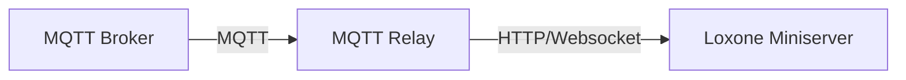
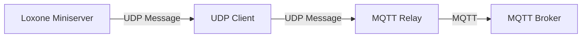

# MQTT Relay for Loxone

[](https://opensource.org/licenses/MIT)


[](https://hub.docker.com/r/acidcliff/loxmqttrelay)

This MQTT Relay enables seamless communication between your MQTT devices/services and Loxone Miniserver.
It is heavily insipred and based upon the extraordinary work of [Loxberry](https://github.com/mschlenstedt/Loxberry) - especially the MQTT Gateway.

The MQTT has been created with several goals in mind:
- Follow best practices established by the Loxberry community
- Providing isolated MQTT bridging capabilites for scenarios, where a full Loxberry installation is not necessary
- Enabling provisioning over Docker
- Optimizing for low power scenarios

To achieve these goals the MQTT Relay for Loxone uses more opionionted and minimalist approach:
1. Inbound communication with the MQTT Relay is done exclusively via UDP, with a reduced featureset compared to Loxberry
2. Outbound communication with the Miniserver is done exclusively via HTTP/Websocket (no UDP capability)
3. Interaction with the MQTT Relay is done primarily via MQTT, configuration is done exclusively via the `config.toml` file, but no integrated functionality like MQTT-Finder, Incoming Message Overview 
4. Except for boolean mapping and JSON flatteining, no transformers
5. No provisioning of an integrated packaged MQTT broker

The general mindset is to use MQTT Relay for Loxone in conjunctin with other tools:
- Using MQTT Monitoring tools like MQTT Explorer to find MQTT-Topics and get information about the processed and forwarded topics from the MQTT Relay
- Using middleware like Node-Red, Homeassistant for transformation of topics
- Using an external MQTT Broker of your choice

> ⚠️ **Disclaimer**: This project is not affiliated with, endorsed by, or connected to Loxone Electronics GmbH in any way. Loxone and Miniserver are trademarks of Loxone Electronics GmbH.

## Quick Start

### Run with docker (recommended)
```bash
# Create a configuration directory and copy the default config
mkdir -p config
curl -o config/config.toml https://raw.githubusercontent.com/Jakob-Gliwa/loxMqttRelay/main/config/default_config.toml

# Edit the config file with your settings
# nano config/config.toml

# Run the container
docker run -d \
  --name loxmqttrelay \
  --restart unless-stopped \
  -v $(pwd)/config:/app/config \
  -p 11884:11884/udp \
  acidcliff/loxmqttrelay

Optionally set -e LOG_LEVEL=DEBUG for more detailed logging
```

### Local installation
```bash
  1. Clone the repository:
    ```bash
    git clone https://github.com/Jakob-Gliwa/loxMqttRelay.git
    cd loxmqttrelay
    ```

  2. Copy the default configuration:
    ```bash
    cp config/default_config.toml config/config.toml
    ```

  3. Edit config/config.toml with your settings:
    ```toml
    [broker]
    host = "your-mqtt-broker"
    port = 1883
    
    [miniserver]
    miniserver_ip = "your-miniserver-ip"
    miniserver_user = "your-user"
    miniserver_pass = "your-password"
    ```

  4. Run:
    ```bash
    uv venv .venv 
    source .venv/
    bin/activate
    uv pip install .
    python loxmqttrelay
    ```
```
## Architecture

#### MQTT Subscribe

```mermaid
graph LR
    MQTT[MQTT Broker] --> |MQTT|Relay[MQTT Relay]
    Relay -->|HTTP/Websocket| Loxone[Loxone Miniserver]
```
#### MQTT Publish

```mermaid
graph LR
    Relay[MQTT Relay] --> |MQTT| MQTT[MQTT Broker]
    UPD[UDP Client] --> |UDP Message| Relay[MQTT Relay]
    Loxone[Loxone Miniserver] -->|UDP Message| UPD[UDP Client]
```


## Features

- Bidirectional communication between MQTT and Loxone
- Dynamic topic filtering and whitelisting
- JSON payload expansion for complex data structures
- Automatic boolean value conversion
- Live configuration updates via MQTT
- Automatic synchronization of whitelisted topics using the Miniserver configuration
- Robust XML parsing with lxml recovery mode for malformed Loxone v16 configurations
- Topic monitoring and processing feedback
- Configuration via `config.toml`

## UDP Communication

The Relay accepts UDP messages on the configured port (default: 11884). Messages should be space-separated in one of these formats:

```
publish topic message    # Explicitly publish a message
retain topic message    # Publish a retained message
topic message          # Defaults to publish
```

Examples:
```
publish home/livingroom/light on
retain home/temperature 22.5
home/kitchen/light off    # Will be published without retain
```

A datagram is forwarded at QoS 0 and is dropped (with a log entry naming the
sender and the reason) when the broker is not reachable - see
[Delivery Guarantees](#delivery-guarantees).

### Accepted senders

By default UDP datagrams are only accepted from the Miniserver configured as `miniserver_ip`; everything else is dropped and logged. Additional senders can be listed in `udp_allowed_sources`, and the whole check can be switched off with `udp_source_filter_enabled = false`:

```toml
[udp]
udp_source_filter_enabled = true
udp_allowed_sources = []          # e.g. ["192.168.1.50", "test-host.local"]
```

Entries may be IP addresses or hostnames and are resolved once at startup. Use the **local** address of your Miniserver here - a DynDNS entry such as Loxone Cloud DNS resolves to the public address of your internet connection, while the Miniserver sends its datagrams from its local address. The relay warns at startup when an allowed sender turns out to be a public address. If no address can be resolved at all, it logs an error and keeps accepting every sender so the bridge does not silently stop working.

Docker bridge networking usually preserves the sender address, so the filter works as expected. If datagrams instead arrive from the container gateway (for example `172.17.0.1` with Docker's userland proxy or Docker Desktop), the real sender is hidden by Docker and cannot be checked. Those datagrams are accepted and a warning is logged once - restrict the UDP port on the host firewall or run the container with `network_mode: host` in that case.

Since anything that can publish to MQTT can control connected devices, restrict the UDP port on your firewall and use broker ACLs (for example in Mosquitto) as a second layer.

## Basic Setup

1. Copy the provided `default_config.toml` as your starting point:
   ```bash
   cp config/default_config.toml config/config.toml
   ```
2. Configure your MQTT broker settings and other preferences in `config.toml`
3. Set up your Miniserver connection details
4. Start the MQTT Relay

## Running the MQTT Relay

Start the MQTT Relay:
```bash
python main.py
```

You can also set the logging level:
```bash
python main.py --log-level INFO
```

## Docker Deployment

You can run the MQTT Relay using Docker, with configurable logging levels.

### Basic Docker Run

```bash
docker run -d \
  -v /path/to/your/config:/app/config \
  -e LOG_LEVEL=INFO \
  -p 11884:11884/udp \
  mqttrelay
```

### Configuration

- **Volume Mapping**: Mount your configuration directory to `/app/config` in the container. This directory should contain your `config.toml` file:
  ```bash
  -v /path/to/your/config:/app/config
  ```

- **Logging Level**: Control the verbosity of logging:
  - Set `LOG_LEVEL` to one of: DEBUG, INFO, WARNING, ERROR, CRITICAL
  - Default is INFO if not specified
  - Example: `-e LOG_LEVEL=DEBUG` for detailed logging

- **Ports**:
  - UDP port (default 11884) for receiving UDP messages

### Example docker-compose.yml

```yaml
version: '3'
services:
  mqttrelay:
    image: acidcliff/loxmqttrelay
    volumes:
      - ./config:/app/config
    environment:
      - LOG_LEVEL=INFO
    ports:
      - "11884:11884/udp"
    restart: unless-stopped
    stop_grace_period: 10s
```

### Stopping the container

`docker stop` sends SIGTERM, which the relay turns into an orderly shutdown: it
closes the UDP socket, publishes `<base_topic>status` = `Disconnecting` and
sends a proper MQTT DISCONNECT before exiting. That normally takes well under a
second; `stop_grace_period` only matters if the broker has become unreachable,
in which case the connection teardown waits for its own timeout. Without the
signal the broker would keep the last `Connected` status until the keep-alive
expires, roughly a minute.

Miniserver requests still in flight are cancelled rather than awaited - see
[Delivery Guarantees](#delivery-guarantees).

## Configuration

The MQTT Relay is configured through a `config.toml` file. A default configuration file (`default_config.toml`) is provided as a starting point with sensible defaults.

The file is checked before anything else happens. Types, port ranges, the log
level and the regular expressions in `subscription_filters` and
`do_not_forward` all have to make sense; if they do not, the relay names **every**
problem it found and exits with status 1 without opening a single connection:

```
Invalid configuration: [broker] 'port' expects int, got str
Invalid configuration: [topics] 'subscription_filters' has an invalid pattern 'device.*(data': missing )
Refusing to start: config/config.toml has 2 unusable value(s). Nothing was connected, nothing was changed.
```

Two habits this puts an end to: `port = "1883"` used to travel all the way to
the MQTT client before failing, and `udp_source_filter_enabled = "false"` - a
string, and therefore true - quietly left the source filter switched on.
Quoting a boolean or a number is now an error rather than a surprise.

Fields the relay does not know are only warned about, not rejected, so a
setting that disappears in an upgrade cannot lock you out of your own relay.

### Logging Configuration

The logging level can be set in three ways, with the following priority (highest to lowest):

1. Command-line argument:
   ```bash
   python main.py --log-level DEBUG
   ```

2. Environment variable (when using Docker):
   ```bash
   docker run -e LOG_LEVEL=DEBUG ...
   ```

3. Configuration file (config.toml):
   ```toml
   [general]
   log_level = "INFO"
   ```

Available log levels: DEBUG, INFO, WARNING, ERROR, CRITICAL
- DEBUG: Detailed information for debugging
- INFO: General operational information
- WARNING: Warning messages for potential issues
- ERROR: Error messages for serious problems
- CRITICAL: Critical issues that may prevent operation

An invalid level in the config file is refused at startup. On the command line
or in `LOG_LEVEL` it falls back to INFO with a warning - a typo there used to
turn on DEBUG, which is the one level that also logs message payloads.

### MQTT Broker Settings
```toml
[broker]
host = "test.mosquitto.org"
port = 1884
user = ""  # null becomes empty string in TOML
password = ""  # null becomes empty string in TOML
client_id = "loxmqttrelay"
```

`client_id` is used as a prefix; the relay appends a random suffix so that
reconnects and restarts never collide with a stale session on the broker.

#### MQTT Protocol Version

The relay speaks MQTT 5 exclusively. Support for MQTT 3.1.x was removed together
with the Python MQTT client; the client is now implemented in Rust on top of
[mqtt-glide](https://crates.io/crates/mqtt-glide). MQTT 5 user properties are
therefore always available (see [MQTT5 User Properties](#mqtt5-user-properties)).

#### Delivery Guarantees

**There are none while the broker is unreachable.** The relay subscribes and
publishes at QoS 0 and keeps no outbox: a message that cannot be handed to the
broker at that moment is dropped, not queued and not retried. This applies to
everything the relay sends - UDP messages coming from the Miniserver, the
`config/response` payload and the status topic alike.

That is a deliberate choice for a home automation relay. A buffered `.../set`
command that is delivered minutes later, after the broker comes back, switches a
light or a blind at a time nobody asked for. A command that is lost is at least
lost visibly - so instead of guarantees, the relay gives you a record of what it
lost:

- Every dropped publish is logged at WARNING with topic, payload size and the
  reason - either `broker not connected` or `publish failed` together with the
  transport error.
- UDP messages that never made it are additionally logged on the way in, with
  the sender address and the original payload.
- An inbound message the relay fails to process is logged at ERROR with the
  topic it arrived on. It is not retried either.
- A subscription the broker rejects (`SUBACK` failure, typically an ACL) is
  logged at ERROR. The relay stays up, but it will not receive anything on that
  filter - so this is worth an alert.
- Disconnects are logged with the reason reported by the broker or transport.

Reconnects are intentionally simple: a fixed 15 second retry, plus one immediate
attempt when a working session drops, and a 5 minute interval once the broker
has refused authentication ten times in a row. The relay resubscribes and
republishes `<base_topic>status` = `Connected` after every reconnect.

The other direction is no different. A value on its way to the Miniserver is
not queued either: over websocket it is written to the socket and never
acknowledged, over HTTP it is one request whose status code is logged. If the
Miniserver cannot be reached, the values of that message are dropped with a log
line and the relay waits 15 seconds before trying to open the connection again -
see [Websocket Communication](#websocket-communication).

If a command must not be lost, do not rely on the relay for it: the Miniserver
should observe the resulting state (e.g. the device's own status topic) and
repeat the command if the state does not follow.

### Topic Management

#### Topic Subscriptions
Configure which MQTT topics to subscribe to:
```toml
[topics]
subscriptions = ["device/#","sensors/#",]
subscription_filters = ["^device/.*/(debug|internal)$"]
topic_whitelist = []
do_not_forward = []
```
Subscriptions define to which topics the MQTT Relay will subscribe. Subscriptions follow the MQTT subcrition syntax.
Subscription filters drop matching topics from further processing - a topic that
matches is not looked at again. They are regular expressions, matched by the
Rust regex engine, which does not support lookahead or backreferences. A pattern
that does not compile stops the relay at startup rather than being skipped, so a
typo cannot quietly let through what it was meant to hold back.
If you just wish to stop topics from being sent to the miniserver use the doNotForward-Option

#### Topic Normalization
When forwarding topics to Loxone, the MQTT Relay automatically normalizes topic names:
- Forward slashes (/) are replaced with underscores (_)
- Percent signs (%) are replaced with underscores (_)

For example:
- `device/status` becomes `device_status`
- `sensor%temp` becomes `sensor_temp`
- `home/living%room/temp` becomes `home_living_room_temp`

This ensures compatibility with Loxone's naming restrictions while maintaining topic readability.

#### Topic Whitelist
Alternatively to (or in combination with subscription filters) a topic whitelist can be defined. Only topics contained in the whitelist will be forwarded to the Miniserver. The topic whitelist is applied to the processed topics (so with boolean mapping and json flatteining applied if so selected) and with the normalization to send it to the Miniserver (so "device/status" becomes "device_status"):
```toml
[topics]
topic_whitelist = ["device_status","sensor_data"]
```

#### Topics to Ignore
Specify topics that should not be forwarded to the miniserver:
```toml
[topics]
do_not_forward = ["internal/topic","private/data"]
```
These are regular expressions and are applied to the processed topic (after JSON
flattening), so a single pattern can also drop individual values out of an
expanded payload. They stay in effect alongside the whitelist: a topic that is
whitelisted but matches `do_not_forward` is still dropped, and a whitelist synced
from the Miniserver does not disable them. An invalid pattern aborts startup with
an error naming the offending expression instead of being silently skipped.

### Data Processing Options
```toml
[processing]
expand_json = false // Expand JSON payloads into individual values
convert_booleans = false // Map boolean-like strings to 1 / 0
```

With `convert_booleans = true`, values such as `true`, `yes`, `on`, `enabled`,
`enable`, `check`, `checked`, `select` and `selected` are forwarded as `1`, and
`false`, `no`, `off`, `disabled` and `disable` as `0` (case-insensitive,
surrounding whitespace ignored). JSON `true`/`false` are mapped the same way.

With `convert_booleans = false`, values are forwarded exactly as received - which
is what you want for payloads like the Zigbee2MQTT `action` field, where `on` and
`off` are commands rather than states.

### Communication Protocols

#### Websocket Communication
The MQTT Relay supports secure websocket communication with the Miniserver:
```toml
[miniserver]
use_websocket = true
```

This is the default, and the path the relay is built around: one connection
carries every value, and its loss is what triggers the
[whitelist resync](#automatic-resync-after-a-miniserver-restart).

When websocket communication is enabled:
- Encrypted communication using AES and RSA
- Token-based authentication, with the token refreshed before it expires
- Automatic reconnection, retried every 15 seconds for as long as it takes
- A keepalive every 60 seconds, so a dead connection is noticed without traffic
- Support for both ws:// and wss:// (secure websocket) connections

What it does not provide is a confirmation per value. A command is written to
the socket and that is the end of it - the Miniserver does not answer it, and
the relay only learns that something is wrong when the connection itself
breaks. If the socket is down when a message arrives, the values from that
message are dropped and logged, naming how many were lost and which topic they
came from; the relay then waits 15 seconds before attempting another handshake,
so an unreachable Miniserver does not turn into a handshake per message. See
[Delivery Guarantees](#delivery-guarantees).

The HTTP path is the opposite trade-off: a separate request per value, each
answered with a status code the relay checks and logs, at the cost of a round
trip - and, with authentication configured, credentials on every one of them.

#### UDP Communication
```toml
[udp]
udp_in_port = 11884
udp_source_filter_enabled = true
udp_allowed_sources = []
```
Attention: Do not change `udp_in_port` if you run MQTT Relay from within Docker - use docker port mapping if you need another port

`udp_source_filter_enabled` restricts incoming UDP to the Miniserver address plus any sender in `udp_allowed_sources`. See [Accepted senders](#accepted-senders) for details.

#### HTTP Communication
```toml
[miniserver]
miniserver_ip = "127.0.0.1"
miniserver_port = 80
miniserver_user = ""
miniserver_pass = ""
miniserver_max_parallel_connections = 5
use_websocket = false
```

## Dynamic Configuration Updates

You can update the relays's configuration on the fly using MQTT messages. All topics are prefixed with your configured `base_topic`.

### What can be changed remotely

An update is applied in full or not at all. Every field is checked before
anything is written, and a rejected update is logged and leaves both the running
configuration and `config.toml` untouched - no restart is triggered either.

Two things are refused:

- **Wrong types.** `{"cache_size": "many"}` is rejected instead of being written
  to the file. Since an update restarts the relay, an unusable value would
  otherwise leave it unable to start.
- **Endpoints and credentials.** `host`, `port`, `user`, `password`,
  `miniserver_ip`, `miniserver_port`, `miniserver_user`, `miniserver_pass`,
  `mock_ip` and `enable_mock` cannot be set over MQTT. Their values are valid,
  so no type check would catch them - but pointing the relay at another host
  would make it authenticate there with your Miniserver credentials. Change
  these in `config.toml` and restart.

Everything else - subscriptions, filters, whitelist, `do_not_forward` and the
processing options - can be changed remotely. Note that anyone able to publish
to `{base_topic}config/#` can do so, so restrict that prefix in your broker ACL
separately from your data topics.

### List Management

#### Set Complete Lists
Topic: `config/set`

Set will ceompletely overwrite the current settings with the given keys.

```json
{
    "subscriptions": ["new/topic1", "new/topic2"],
    "topic_whitelist": ["new_whitelist_topic"]
}
```

#### Add to Lists
Topic: `config/add`

Add is just available for lists and will add the given elements to the list of the given keys.

```json
{
    "subscriptions": ["additional/topic"],
    "topic_whitelist": ["new_allowed_topic"]
}
```

#### Remove from Lists
Topic: `config/remove`

Remove is just available for lists and will remove the given elements to the list of the given keys.

```json
{
    "subscriptions": ["topic/to/remove"],
    "topic_whitelist": ["topic_to_unallow"]
}
```

### Get Current Configuration
Topic: `config/get`

Publish any message to this topic to receive the current configuration. The relay will respond on `config/response` with the current configuration in JSON format. Note that sensitive information (login credentials) will be removed from the response.

Example response on `config/response`:
```json
{
    "broker": {
        "host": "192.168.X.X",
        "port": 1883
    },
    "base_topic": "mqttrelay/",
    "subscriptions": ["device/#", "sensor/#"],
    "topic_whitelist": ["device_status", "sensor_data"],
    "expand_json": true,
    "convert_booleans": true,
    "udpinport": 11884,
    "use_http": true,
    "miniserver_ip": "192.168.X.X"
}
```

### Control Commands

- `{base_topic}/config/update`: Reload configuration from file
- `{base_topic}/config/restart`: Restart the MQTT Relay application

## Miniserver Integration

### Automatic Configuration Sync

Enable automatic synchronization with your Miniserver's configuration:
```json
[miniserver]
sync_with_miniserver = true
```

When enabled, the relay will:
- Automatically load Miniserver configuration on startup
- Update the topic whitelist based on Miniserver inputs
- Resync when Miniserver configuration changes

Caution: This function will assume that every Virtual Input is a possible target for forwarding mqtt messaages.

### Automatic Resync After a Miniserver Restart

When the websocket connection to the Miniserver is lost and later re-established, the relay resyncs the whitelist automatically. A restart is the usual consequence of uploading a new configuration, so this keeps the whitelist in step without any extra setup.

This requires `use_websocket = true` — a plain HTTP setup has no persistent connection whose loss could be observed. The websocket itself is opened as soon as the first message is forwarded to the Miniserver.

### Trigger Manual Sync

Configure your Miniserver to publish any message to `{base_topic}/miniserverevent/startup` on startup to trigger an automatic resync with the Miniserver configuration.

## Testing Setup

For development and testing, you can point the MQTT Relay to a mock Miniserver (basically any HTTP server):
```toml
[debug]
mock_ip = "192.168.X.X:<port>"
enable_mock = true
```

It is not possible to use the mock Miniserver functionality with the websocket communication.
To make the mock Miniserver work, you need to set the `use_websocket` option to `false` in the `[miniserver]` section.
```toml
[miniserver]
use_websocket = false
```

The mock server needs to support the following endpoints:
- `http://{mock_ip}/dev/sps/io/{topic}/{value}`
- `http://{mock_ip}/dev/sps/io/{topic}/`

The mock server needs to return a 200 status code for successful requests.

The mock Miniserver functionality can be enabled/disabled without removing the IP configuration:
- `mock_ip`: The IP address and port of your mock Miniserver
- `enable_mock`: Enable or disable the mock Miniserver functionality (default: false)

## Note

- The relay automatically restarts after configuration changes to apply new settings
- Regular backups of your configuration file are recommended
- Test configuration changes in a development environment first
- Topic monitoring can increase MQTT traffic, enable only when needed
- Live configuration updates via MQTT
- Automatic synchronization of whitelisted topics using the Miniserver configuration
- Topic monitoring and processing feedback

## UDP Communication

The Relay accepts UDP messages on the configured port (default: 11884). Messages should be space-separated in one of these formats:

```
publish topic message    # Explicitly publish a message
retain topic message    # Publish a retained message
topic message          # Defaults to publish
```

Examples:
```
publish home/livingroom/light on
retain home/temperature 22.5
home/kitchen/light off    # Will be published without retain
```

## UDP Message Format Details

The MQTT Relay accepts simple text messages via UDP that tell it what to publish to MQTT. Here's how to format your messages:

### Basic Usage

1. **Simple Messages** (automatically published):
```
kitchen/light on
bedroom/fan off
living/temperature 22.5
```

2. **Messages with Retain Flag** (stays on MQTT broker after disconnect):
```
retain kitchen/light on
retain living/temperature 22.5
```

3. **Explicit Publish** (same as simple messages):
```
publish kitchen/light on
```

### Working with Complex Topics

1. **Topics with Spaces**:
Although it's a discouraged MQTT practice, you can use spaces in your topics naturally:
```
zigbee2mqtt/Living Room Light/set on
zigbee2mqtt/Kitchen Counter/brightness 80
```

Spaces however are only allowed between tokens, not at end of a topic.

```
zigbee2mqtt/Living Room Light/set status on -> topic: zigbee2mqtt/Living Room Light/set, payload: status on
zigbee2mqtt/Kitchen Counter/brightness 80 -> topic: zigbee2mqtt/Kitchen Counter/brightness, payload: 80
```

2. **JSON Messages**:
For devices that need JSON data, just include the JSON part at the end:
```
home/lights {"state": "on", "brightness": 100}
zigbee2mqtt/Living Room Light/set {"state": "ON", "brightness": 255}
```

The JSON payload will be sent as-is with no validation or quoting of the JSON string.
Everything before the first `{` is considered the topic.

### MQTT5 User Properties

You can attach MQTT 5 user properties to a message coming from Loxone. Add an optional block in square brackets right after the (optional) command and before the topic:

```
[publish|retain] [key1=value1;key2=value2] topic payload
```

Rules:
- The block is optional. It is only treated as user properties if it starts with `[`, has a closing `]`, and contains **at least one real `key=value` pair** (non-empty key, `=` present). Otherwise the `[...]` is treated as a normal part of the topic.
- Pairs are separated by `;`, key and value by the first `=`. Values may contain spaces and additional `=` characters because the block is delimited by `]`.
- Empty values are allowed (e.g. `[flag=]`). Multiple pairs, including duplicate keys, are allowed (MQTT 5 permits repeated user property keys).
- Malformed segments (e.g. without `=` or with an empty key) are skipped with a warning.

Examples:
```
publish [source=loxone;room=kitchen] home/light on
[unit=celsius] home/temp 22.5
retain [origin=ms1] home/status online
```

Notes:
- User properties are only sent when MQTT 5 is enabled. If you provide them while running in MQTT 3.1.x mode, they are ignored (with a log warning).
- Limitation: a topic must not start with a valid `[key=value;...]` block, since that prefix is interpreted as user properties.

### Common Examples

Here are some typical use cases:

```
# Basic light control
kitchen/light on
living/light off

# Setting values
bedroom/temperature 21.5
kitchen/humidity 45

# Device control with JSON
home/thermostat {"mode": "heat", "target": 22}

# Retained status messages
retain home/system/status online
retain home/sensor/battery 80
```

## Credits and Inspiration

This project was inspired by and builds upon the work of several other projects:

- [The folks at Loxberry](https://github.com/mschlenstedt/Loxberry): For the original idea and implementation, their relentless work for the Loxone Community and sheer masterful work on Loxberry and its main plugins
- [JoDehli (PyLoxone, pyloxone-api)](https://github.com/JoDehli/PyLoxone): For the Loxone Miniserver communication protocol implementation I adapted the websocket listener from
- [Alladdin](https://github.com/Alladdin): For his Loxone related reference implementation and research
- [Node-Red-Contrib-Loxone](https://github.com/codmpm/node-red-contrib-loxone): For the Node-Red Loxone plugin, which made testing much easier and provided valueable insights in handling the websocket communication
- [Loxone](https://www.loxone.com/enen/kb/api/): For building such a great home automation ecosystem and providing the openness to build upon it

## Contributing

Contributions are welcome! Please feel free to submit a Pull Request. For major changes, please open an issue first to discuss what you would like to change.

## License

This project is licensed under the MIT License - see the [LICENSE](LICENSE) file for details.

